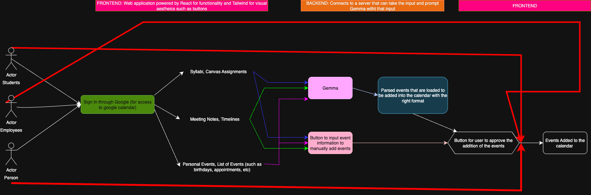

# Deadline Manager

**Deadline Manager** is a **one-stop-shop, AI-boosted application** that simplifies event management. You input a list of deadlines or events, and the AI extracts the relevant details and presents them for your approval before seamlessly adding them to your **Google Calendar**.

Whether you're a student, teacher, employee, or simply someone tracking important dates, this application eliminates the hassle of manually adding complex events.

---

## Table of Contents
- [Quickstart Guide](#quickstart-guide)
- [Features](#features)
- [Demo Videos](#demo-videos)
- [Architecture Diagram](#architecture-diagram)
- [Usage Examples](#usage-examples)
- [FAQ](#faq)

---

## Quickstart Guide

**Prerequisites:**
* A **Google account** is required.
* This application interacts with your Google Calendar. You will be prompted to give authorization for the app to **modify your calendar**.

**Access the application here:**
[Deadline Manager](https://shriyabi.github.io/deadline_tracker_more/)

1.  Click **Sign In** (green button at the top right).
2.  Authorize the application to access your Google Calendar.

> **Note:** The application is currently in the testing phase and has not yet been approved by Google. If you would like to be added as a test user, please email **sbiddala@umich.edu**.

---

## Features

* **View events** for selected Google Calendars as per-calendar lists on your dashboard.
* **Manage calendars**: Add, edit, or delete Google calendars directly within the app.
* **Manual Event Management**: Manually add or delete events, specifying the title, time, and date (location entry is not supported yet).
* **AI-Powered Extraction**: Input a string of events with due dates and times, and **Gemma AI** will extract the events and list them on your dashboard for **approval** before adding them to a user-specified calendar.

---

## Demo Videos

Here are short demonstrations of the app in action:

**Selecting Calendars**

*Description: This GIF shows how the user can select desired calendars to view on their dashboard and remove them once done.*

**Using AI Assignment Extraction**

*Description: This GIF shows how the user can input events, get them back in a ready-to-add format, and then add, edit, or delete events before final approval.*

---

## Architecture Diagram

---

## Usage Examples

Here are some screenshots showcasing the application's key features:

### Application Features Overview

1.  **Navigation Bar**
    
    *Description: This image displays the main navigation bar on the left side, providing links to key sections like the Dashboard, Calendar, and various Tools.*

2.  **Dashboard View**
    
    *Description: The application's dashboard, offering a centralized view of upcoming events, recent activities, and quick access to core features.*

3.  **Calendar Management Tools**
    
    *Description: An interface dedicated to managing calendar entries, featuring options to **Add, Edit, and Delete** calendars.*

4.  **Gemma Text Input Interface**
    
    *Description: A specialized tool designed for inputting text directly into the **Gemma AI model**, enabling event extraction.*

5.  **Event Creation Form**
    
    *Description: The form used for adding a new event to the calendar, where users can define event details such as title, date, time, and description.*

---

## FAQ

**Q: What does this app do?**
A: This app helps you manage deadlines by organizing your tasks, events, and due dates across multiple calendars. It also uses **Gemma AI** to detect and suggest events from your text, which you can approve to add to your chosen calendar.

**Q: Do I need a Google account?**
A: Yes, a Google account is required so you can securely save and manage your calendars and events across devices.

**Q: How do I create a new calendar?**
A: Go to the **Calendar Settings** tab under Tools and tap **Create Calendar**. Enter a name.

**Q: How do I edit or delete a calendar?**
A: In the **Calendar Settings** tab, select the calendar you want to edit or delete. Select **Edit** to update its name or **Delete** to remove it entirely. *(Note: deleting a calendar will also delete its events.)*

**Q: Can I select which calendar to use when adding an event?**
A: Yes — when adding or approving an event, you’ll be prompted to select which calendar it should go into.

**Q: How do I add an event manually?**
A: Open your calendar, tap the **Add Event** button under Tools, and fill in the event details such as title, date, and time.

**Q: How do I delete an event?**
A: Use the **Delete** button next to the event name when you view the respective calendar.

**Q: How does Gemma help me manage events?**
A: **Gemma** analyzes your input (like emails, messages, or notes) and extracts potential deadlines or events. It then presents them to you for **approval** before adding them to your calendar.

**Q: Will Gemma automatically add events without asking me?**
A: **No**. Gemma will only suggest events. You always decide whether to add them and to which calendar.

**Q: What kind of events can Gemma detect?**
A: Common ones include due dates, meeting times, reminders, and recurring tasks. For example: *“Project due on Oct 12”* or *“Team meeting every Friday at 10am.”*

**Q: Can I reject events suggested by Gemma?**
A: Yes. You will always have the option to reject or edit events before they’re added.

**Q: Are my events private?**
A: Yes. Your events and calendars are only accessible to you. Gemma’s suggestions are processed securely and **no personal information is stored**. You always control what gets added.
