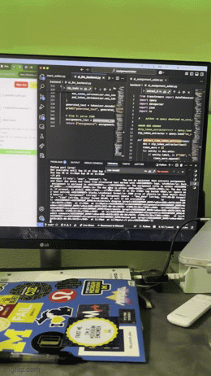
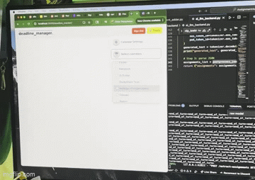
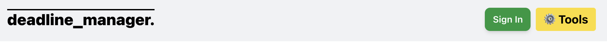
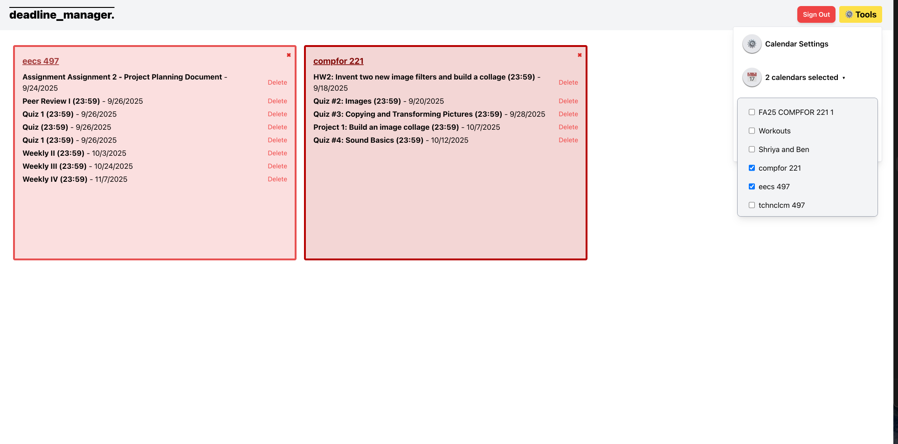
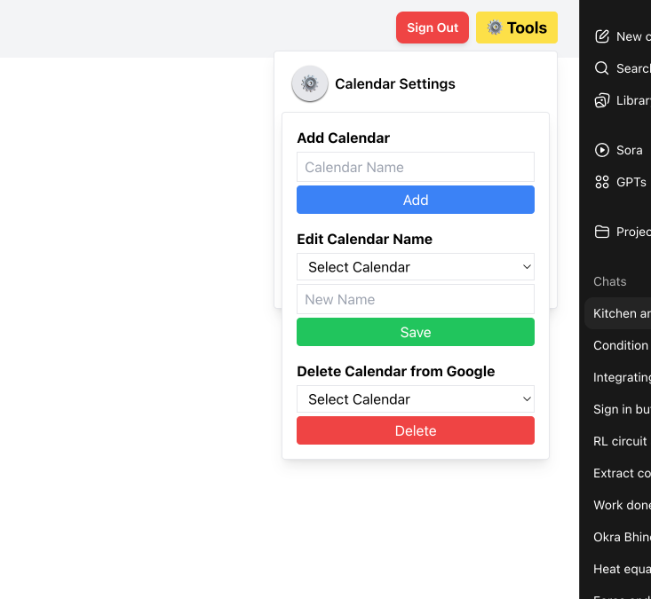
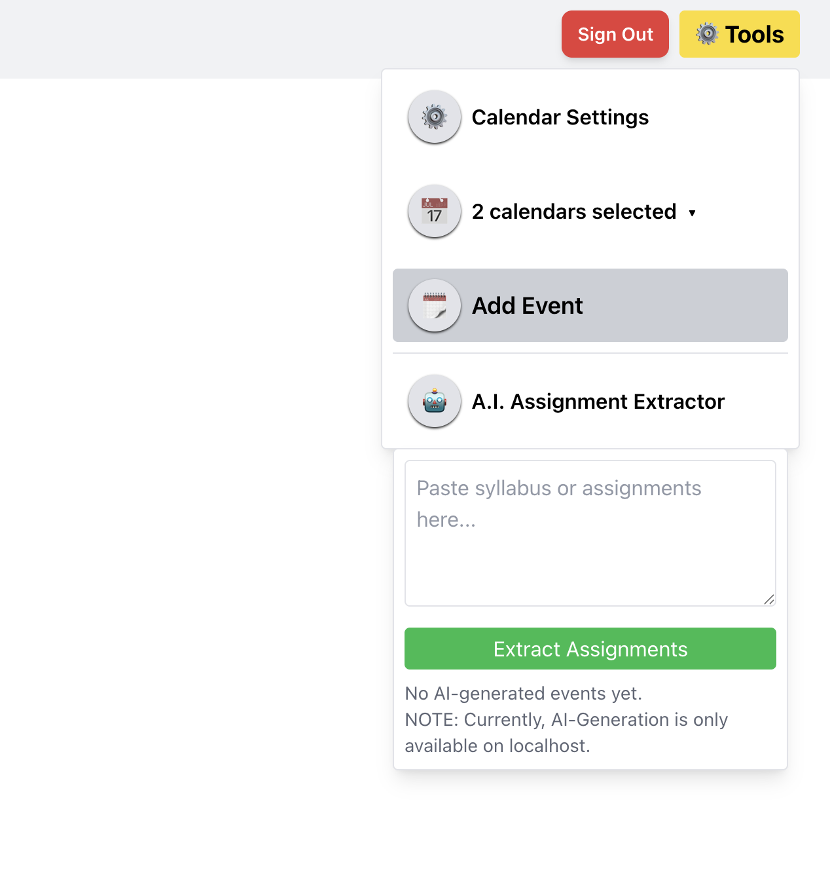
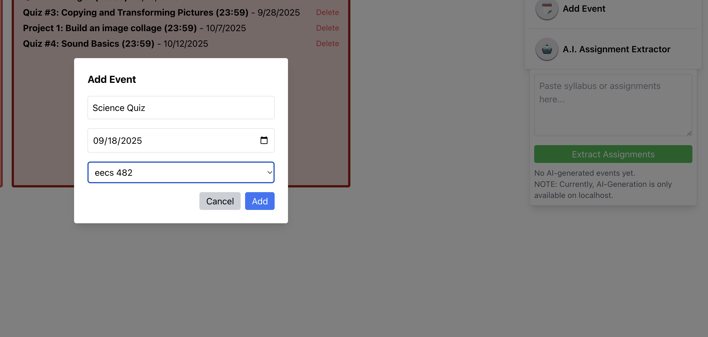

# Deadline Manager

**Deadline Manager** is a one-stop-shop AI-boosted application that allows you to input a list of events, and all you need to do is approve the addition of each event to your Google Calendar. The AI will create events based on your input.  

Whether you are a student, a teacher, an employee, or simply someone with dates to track, this application makes your life easier by eliminating the hassle of manually adding events.

---

## Table of Contents
- [Quickstart Guide](#quickstart-guide)
- [Features](#features)
- [Architecture Diagram](#architecture-diagram)
- [Usage Examples](#usage-examples)
- [FAQ](#faq)

---

## Quickstart Guide

**Prerequisites:**  
- A Google account is required.  
- This application interacts with your Google Calendar. You will be prompted to give authorization for the app to modify your calendar.  

**Access the application here:**  
 [Deadline Manager](https://shriyabi.github.io/deadline_tracker/)  

1. Click **Sign In** (green button at the top right).  
2. Authorize the application to access your Google Calendar.  

Note: Currently the application is in the testing phase and has not yet been approved by Google.  
If you would like to be added as a test user, please email **sbiddala@umich.edu**.  

---

## Features

- View events for selected Google Calendars as per-calendar lists on your dashboard.  
- Add, edit, or delete Google calendars.  
- Manually add or delete events where you can specify the title, time, and date (location not supported yet).  
- Input a string of events with due dates and times, and **Gemma AI** will extract the events and list them on your dashboard for approval before adding them to a user-specified calendar.  

### Demo Videos
Here are short demos of the app in action:

  
  

---

## Architecture Diagram

  

---

## Usage Examples

Here are some screenshots of real usage:

  
  

   
   

---

## FAQ

**Q: What does this app do?**  
A: This app helps you manage deadlines by organizing your tasks, events, and due dates across multiple calendars. It also uses Gemma AI to suggest events it detects from your text or documents, which you can approve to add to your chosen calendar.

**Q: Do I need to create a Google account?**  
A: Yes, a Google account is required so you can securely save and manage your calendars and events across devices.

**Q: How do I create a new calendar?**  
A: Go to the **Calendar Settings** tab under Tools and tap **Create Calendar**. Enter a name.

**Q: How do I edit or delete a calendar?**  
A: In the **Calendar Settings** tab, select the calendar you want to edit or delete. Select **Edit** to update its name or **Delete** to remove it entirely.  
*(Note: deleting a calendar will also delete its events.)*

**Q: Can I select which calendar to use when adding an event?**  
A: Yes — when adding or approving an event, you’ll be prompted to select which calendar it should go into.

**Q: How do I add an event manually?**  
A: Open your calendar, tap the **Add Event** button under Tools, and fill in the event details such as title, date, and time.

**Q: How do I delete an event?**  
A: Use the **Delete** button next to the event name when you view the respective calendar.

**Q: How does Gemma help me manage events?**  
A: Gemma analyzes your input (like emails, messages, or notes) and extracts potential deadlines or events. It then presents them to you for approval before adding them to your calendar.

**Q: Will Gemma automatically add events without asking me?**  
A: No, Gemma will only suggest events. You decide whether to add them and to which calendar.

**Q: What kind of events can Gemma detect?**  
A: Common ones include due dates, meeting times, reminders, and recurring tasks.  
For example: *“Project due on Oct 12”* or *“Team meeting every Friday at 10am.”*

**Q: Can I reject events suggested by Gemma?**  
A: Yes. You will always have the option to reject or edit events before they’re added.

**Q: Are my events private?**  
A: Yes. Your events and calendars are only accessible to you. Gemma’s suggestions are processed securely and no information is stored. You always control what gets added.

---
